# Setup End-to-end Connection
## Introduction
 In this section we setup the end-to-end communication between the SAP S/4HANA on-premise system and the SAP Cloud Platform account. To establish it we have to define an account in SAP Cloud Connector and configure the connection to each system. Then we define a destination on SAP Cloud Platform to use this connection setting.

**Personas:** In this section the SAP S/4HANA admininstrator and the SAP Cloud administrator have to work together.

## Step-by-Step

### **A: Configure End-to-end Connection in SAP Cloud Connector**

1. Get the connection information of your SAP Cloud Platform Subaccount
   1. Logon to your SAP Cloud Platform Subaccount. From the Overview page we need the following environment info.
   2. Subaccount ID
   3. API Endpoint 
   
   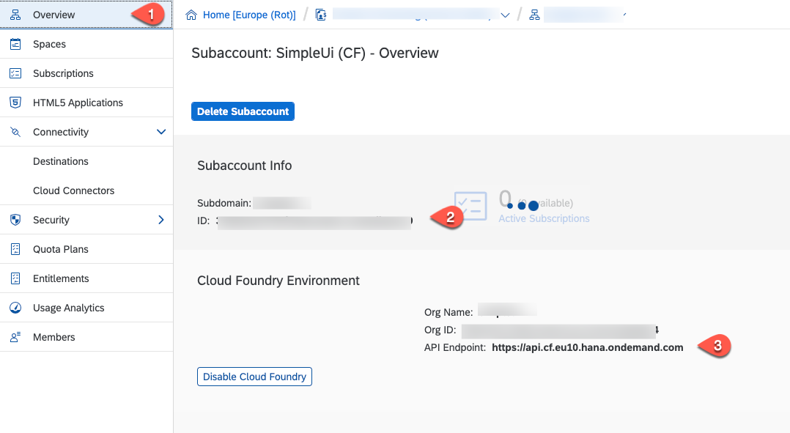 

2. (optional) If you don't want to use the SAP Cloud Platform administrator credentials as Communication User you can create a new user with the technical roles for the Cloud Connector. You find more details here:
   
   [Communication User](https://help.sap.com/viewer/cca91383641e40ffbe03bdc78f00f681/Cloud/en-US/daca64dacc6148fcb5c70ed86082ef91.html) 

3. Create a new Connector to your SAP Cloud Subaccount. 
   1. Login to the SAP Cloud Connector and select the Connector entry
   2. Click on "+ Add Subaccount"
   
   

4. Do the following
   1. Region: Select the region of the API Endpoint of your Subaccount
   2. Subaccount: Enter the ID of your Subaccount
   3. Display Name: The name of this connection which is displayed in your SAP Cloud Platform subaccount
   4. Login E-Mail: Name of the connection user
   5. Password: Password of the connection user
   6. Description: Enter a meaningful description 
   7. Click on Save

   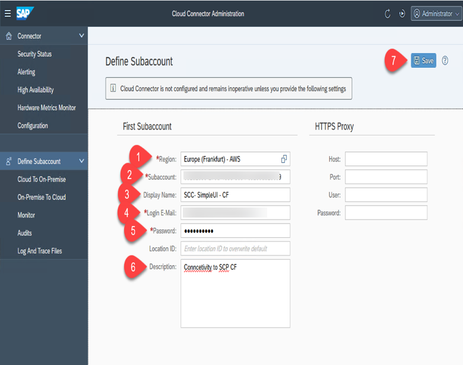 

5. Cloud to on-premise Setup
   1. In the added Subaccount, select the "Cloud to On-Premise" tabulator.
   2. In the "Mapping Virtual to Internal System" section click on the button "+"
   
   

6. In the screens of the "Add System" Wizzard enter the following:
    
    1. Select ABAP - next
   
    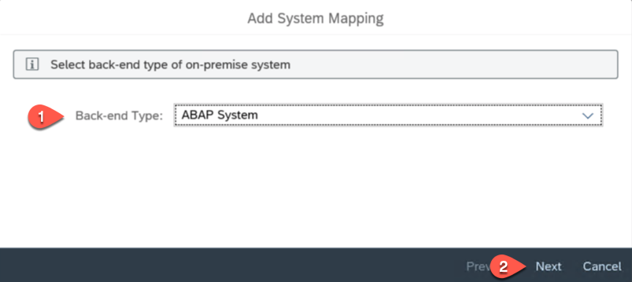 
   
    2. Select HTTPS - next

    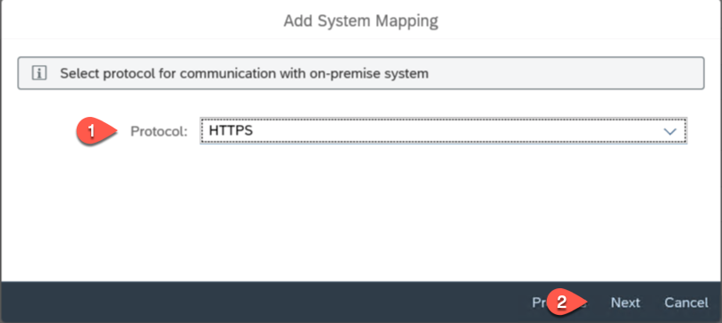 

    3. Enter the host (IP Adress or host name) and port of your SAP S/4HANA system - next

    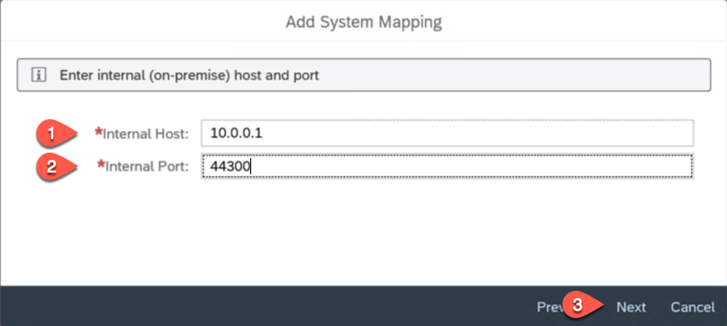 

    4. Enter a virtual host name and port. - next
   
     ***Hint:** For security reasons it's recommended that the virtual host and port differ from the host and port of the on-premise system*

    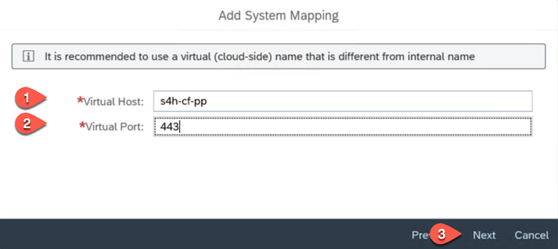 

    5. Select X.509 Certificate (General Usage) - next

    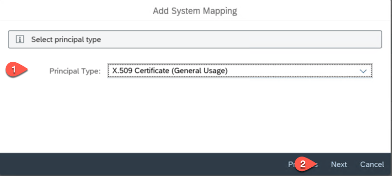 

    6. For the Host in Request Header select "Use Virtual Host" - next
   
    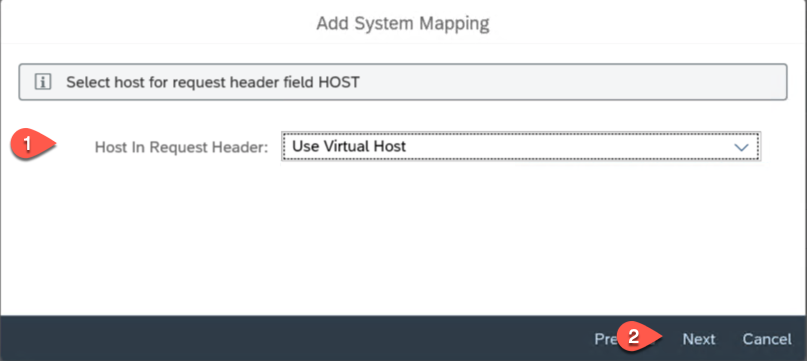 

    7. Enter a description for the system mapping - next

    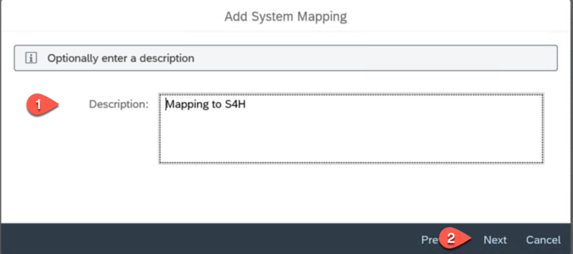 

    8. In the Summary check "Check Internal Host" - click on Finish

    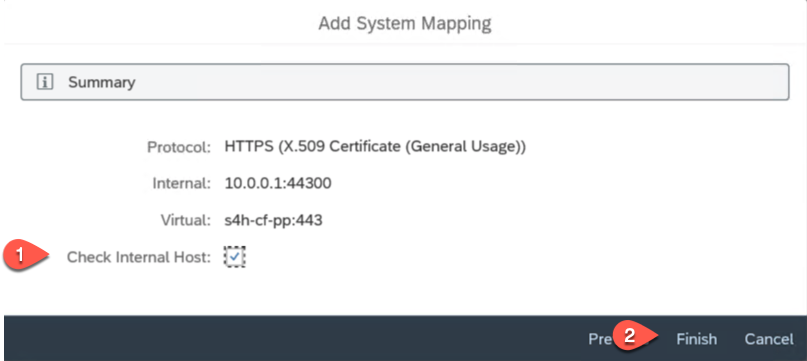 

7. In the resource section press + to add a resource
    
    

8. Add Resource
   1. Enter the URL path to the Business Partner API: /sap/opu/odata/sap/API_BUSINESS_PARTNER
   2. AccessPolicy: set "Path and all sub-paths"
   3. Enter a description
   4. Press Save
   
   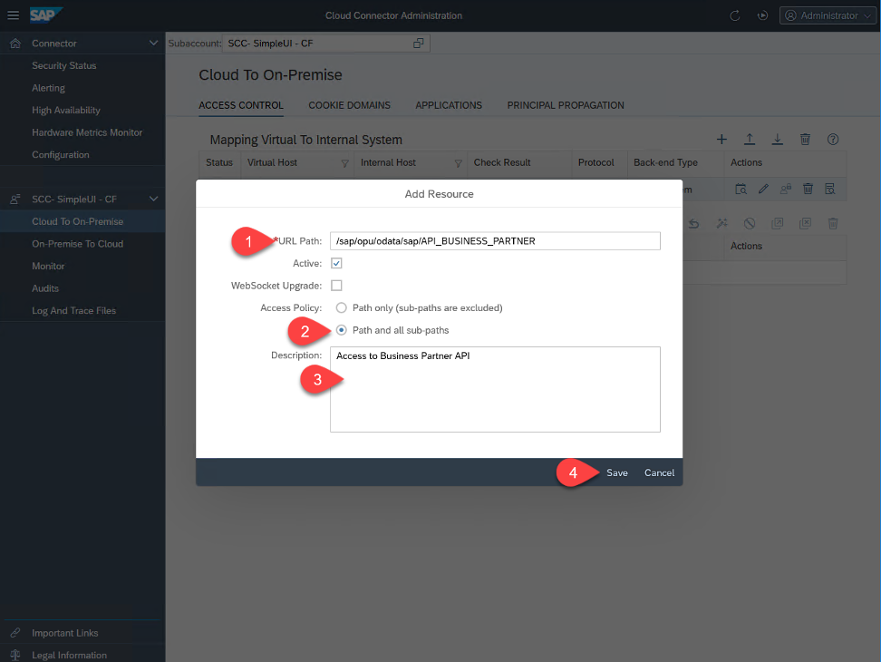

   ***Hint:** You can either add for each oData service a resource or you set the URL path just to /sap/opu/odata/sap then all activated oData services are exposed. For security reasons and to keep a better control for the usage of the oData services the first approach should be preferred.* 

9.  Synchronize your settings with your SAP Cloud Platform account
    1.  Select the "Principal Propagation" tabulator
    2.  Click on Synchronize

    

10. Check the availability of the internal system 
    1. In the Access Control tabulator click on "Check availability of internal host"
    2. Status should be green
    3. Check Result should turn to Reachable 
   
     

11. In the overview of your subaccount you can see the Connectore State to the SAP Cloud Platform
 
    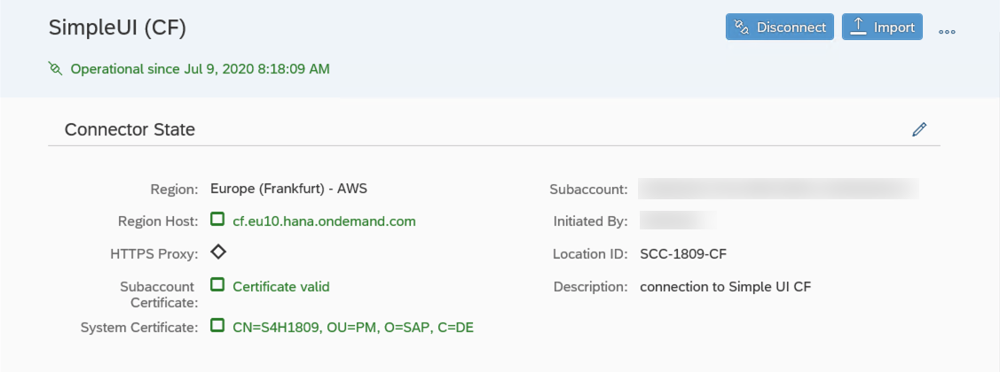

With this step the on-premise setup is finished.

### **B: Create Destination on SAP Cloud Platform**

1. Login to your SAP Cloud Platform subaccount 
2. Create a new Destination
   1. Open the Connectivity entry and select Destination
   2. Click on "New Destination" 

   

3. Setup Destination - enter the following values
    * "Name" - e.g. bupa  --> this destination is later used at the sample application 
    * "Type" - select HTTP
    * "URL" - URL of the Business Partner API that we have exposed in the SAP Cloud Connector =  https://\<virtual host\>:\<virtual port\>/sap/opu/odata/sap/API_BUSINESS_PARTNER
    * Proxy Type: "OnPremise"
    * Authentication: "Principal Propagation"
     
    Add the following properties by clicking on the "New Property" button:

    * Name: "HTML5.DynamicDestination" - value: "true"
    * Name: "SAP-Client" - value: "the SAP-Client of your SAP S/4HANA system"
    * Name: "WebIDEEnabled" - value: "true"
    * Name: "WebIDEAdditionalData" - value: "full_url"
    * Name: "WebIDEUsage" - value: "odata_gen"

   

4. Click on Save and the click on "Check Connection"
      
   

*[See also destination management on SAP Cloud Platform](https://help.sap.com/viewer/cca91383641e40ffbe03bdc78f00f681/Cloud/en-US/84e45e071c7646c88027fffc6a7bb787.html)*

### **C: Troubleshooting**
Here are some hints when you face later errors by calling a backend service with Principal Propagation:  

1. Ensure that you are using the latest version latest version of SAP Cloud Connector and Java VM 

   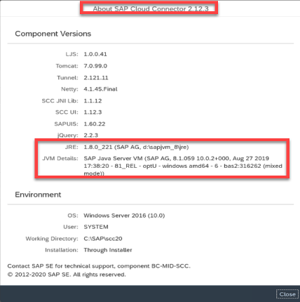

2. Set the trace log level in SAP Cloud Connector. Enable TLS Trace.

   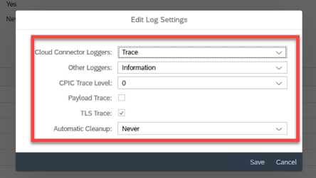

3. In SAP S/4HANA syste call SAP Transaction Codes: “SMICM” or “SM50” - go to View Log - set Trace Level to : 2
   
   **Hint:** Reset the log level back to the default values when done

   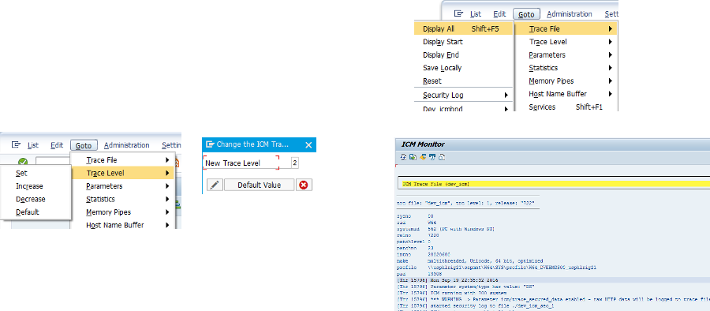

4. Then again start a request from the SAP Cloud Platform application.
5. If Principal Propagation is not working check in Cloud Connector ljs_trace.log the x.509 short live certificate

   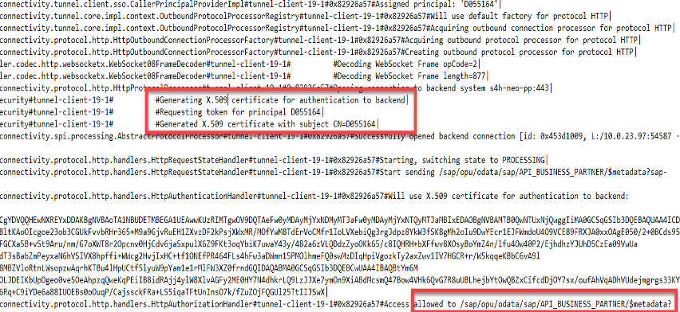

6. Check Trusted Authorities in ljs_trace.log 

   

7. Check the short live certificate sent to the backend

   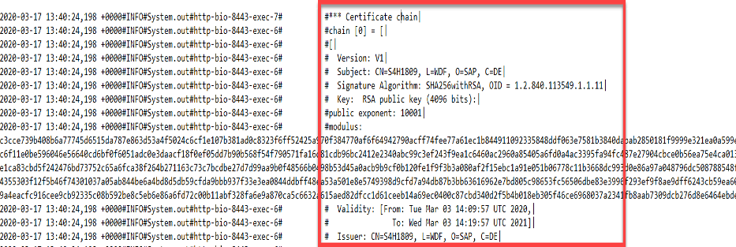

8. In the SAP S/4HANA system check if the forwarded short live certificate is accepted in the backend

   

Additional links:

* [Blog: SAP Cloud Connector Troubleshooting](https://blogs.sap.com/2019/01/26/cloud-connector-guided-answers-and-troubleshooting/)
* [SAP Cloud Connector: Guided Answers](https://ga.support.sap.com/dtp/viewer/index.html#/tree/2183/actions/27936)

## Summary
We have established a secure connection between the SAP S/4HANA on-premise system and the SAP Cloud Platform (SCP) account and we're now ready for building SAP S/4HANA extension on the SCP.

