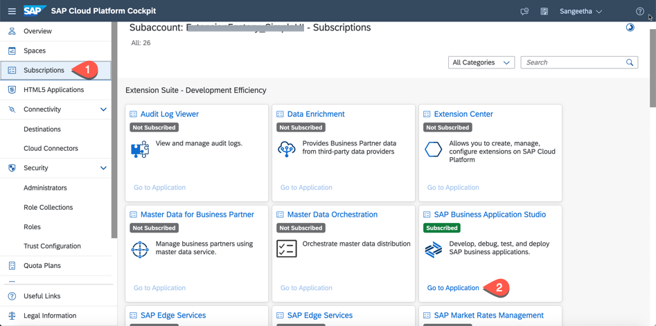
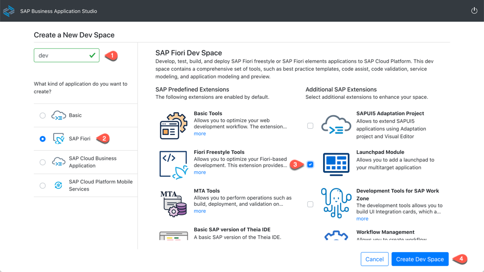
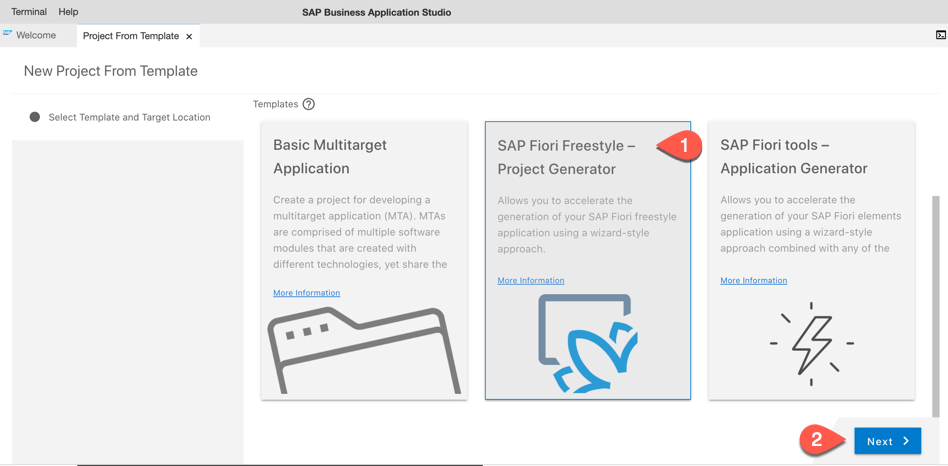
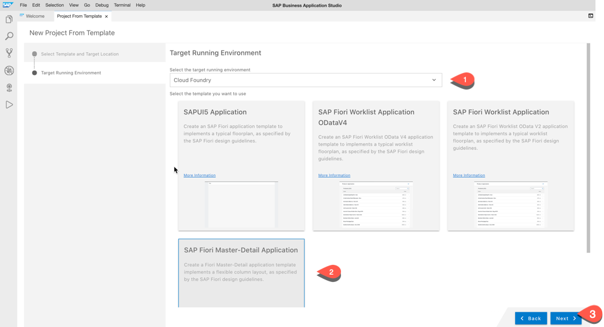
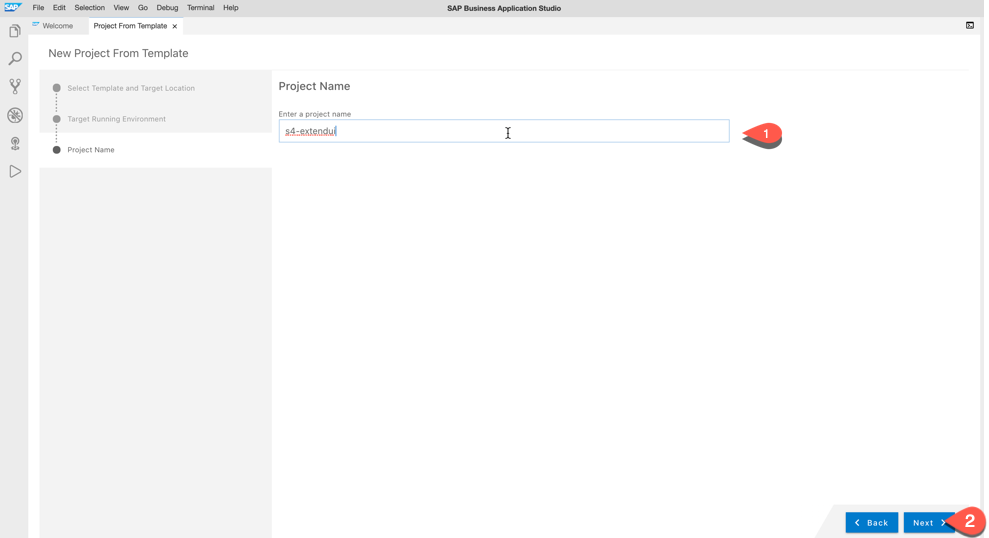
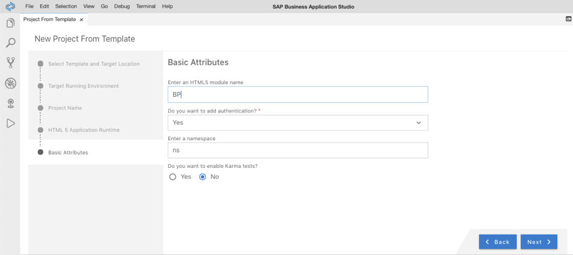
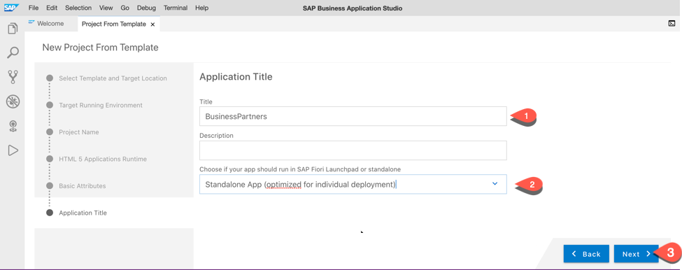
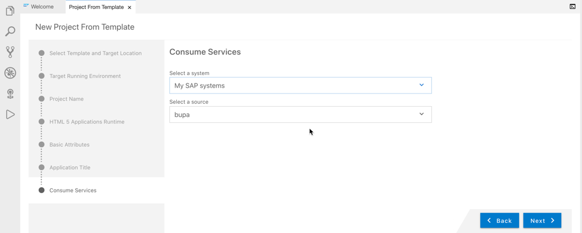
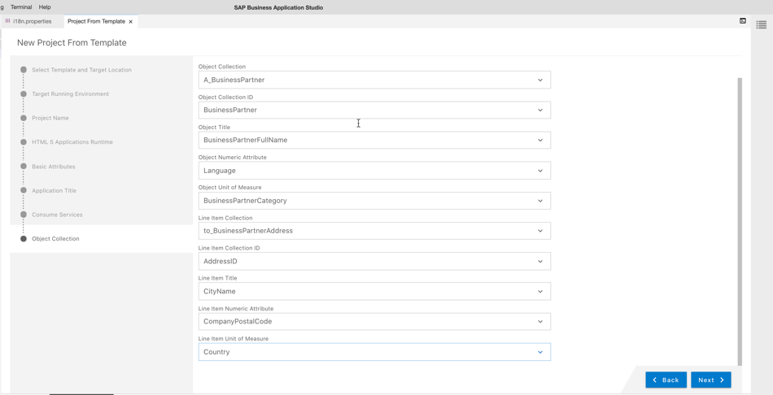

# Developing a Cloud Application

## Introduction

In this section, we would describe steps to develop a cloud application using SAP Business Application Studio.

**Persona:** UX Developer

## Step-by-Step

### Setup SAP Business Application Studio with Dev workspace

1. Login to your SAP Cloud Platform account. 
2. Goto your Subaccount and click on Subscriptions. 
3. Search for **Business Application Studio** and click on "Go to Application". If you have not yet Enabled this service, click on this tile and click on "Subscribe" and then open the application.

   
   
4. You would be prompted with a login screen of the custom Identity Provider what you have configured.
5. Login to the Application using your custom Identity Provider credentials.
6. Click on “Create Dev Space”.
7. Enter the name of the space and Choose “SAP Fiori” and select “Launchpad Module” from Additional SAP Extensions and click on "Create Dev Space".

   
  
8. Once the devspace is created, open it.
9. In the tabs, click on View-> Select “Find Command”.
10. Search for “CF Login”.
11. Select for “CF: Login on to Cloud Foundry”.

    
    
12. Enter CF API endpoint or take the default suggested API endpoint. You can find the API endpoint of your region by logging into your SAP Cloud Platform account and copy the API Endpoint. Also write down the 'Org Name' into a text editor of your choice which is needed for the next step. 

    
    
13. Choose 'Spaces' and write down the space name to a text editor of your choice. 

    
     
14. Enter “Email” and “Password” when prompted.
15. Select your Cloud Foundry "Org" which you have noted down in step 11. 
16. Select the space name which you have noted down in step 12. Once you have selected the Org and Space, you would login to Cloud Foundry in SAP Business Application Studio.
17. Now we have successfully created a Dev workspace and pointed to our desired Cloud Platform "Org" and "Space".

### Develop the application from project template

1. Click on “Create project from template” in the Welcome page to create the project. Alternatively, Go to View -> Find Command and search for “Create Project”. Select the command “SAP Application Studio: Create project from Template”

    
2. In the New Project Wizard, Select “Fiori Project”. Click "Next"

    

3. Select Target Running Environment as “Cloud Foundry”.
4. Select Template as “SAP Fiori Master Detail Application”. Click "Next".

    
5. Enter Project Name as s4-extendui. Click "Next".
    
    

6. Choose “Managed by SAP Cloud Platform” as HTML5 Application runtime.
7. Enter “bpServiceManaged” as Managed service name. Click "Next".

    
    
8. Enter “BP” as html5 module. Click "Next". 

    
9. Enter Title “BusinessPartners”.
10. Select Standalone App (Optimized for individual development). Click "Next".

    
    
11. Select the system as “My SAP Systems”
12. For the field "Select source" select the earlier created destination pointing to your SAP backend system, which we named “bupa”. Click "Next".

    
    
13. For the different fields of "Object Collection" :
     - Select drop-down Object Collection to “A_BusinessPartner”.
     - Select drop-down Object Collection ID to “BusinessPartner”.
     - Select drop-down Object Title to “BusinessPartnerFullName”.
     - Select drop-down Object Numeric Attribute to “Customer”.
     - Select drop-down Object Unit of Measure to “Supplier”.
     - Select drop-Down Line Item Collection to “to_BusinessPartnerAddress”.
     - Select drop-down Line Item Collection ID to “AddressID”.
     - Select drop-down Line Item Title to “Full Name”.
     - Select drop-down Line Item Numeric Attribute to “Country”.
     - Select drop-down Line Item Unit of Measure to “CityName”.
     - Click "Next" and "Finish" to finish the project creation.

    
    
14. Once the project is created, Click on the button “Open in New Workspace” in the popup.

    
    
### Result
You have now configured a development workspace and created a HTML5 Application successfully.
