# Setup of the SAP S/4HANA on-premise System

## Introduction

In this section we learn how to activate an API oData service in a SAP S/4HANA on-premise system, create a user and assign the necessary roles and authorization objects.

**Persona:** S/4HANA Administrator

## Step-by-Step

***Hint:** The following screenshots are done with SAP GUI 7.50 - by using SAP GUI 7.60 the usage could differ e.g tick button instead of a continue button etc.*

### Activate oData Service
1. Logon S/4HANA system using SAP GUI with your adminstrator user.
2. Call transaction /n/IWFND/MAINT_SERVICE.
3. Click on "Add Service"

   
4. In the Add Service screen enter the following values:
   1. System Alias = LOCAL
   2. Technical Service Name = API_BU*
   3. Press enter - you should see the API_BUSINESS_PARTNER in the list box.
   
   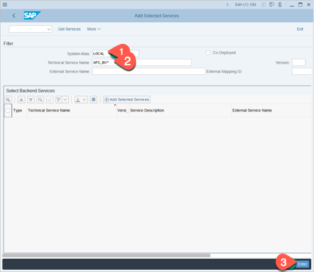

5. Check the box of API_BUSINESS_PARTNER and click on "Add Selected Service"
 
   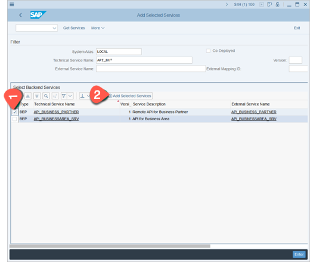

6. The "Add Service" screen opens
   1. Specify "Package Assignment” e.g. $TMP by clicking on Local Object
   2. Enable the checkbox for “Enable OAuth for Service”
   3. Click on Continue to activate the changes
   4. Click on Continue to confirm the message box
   
   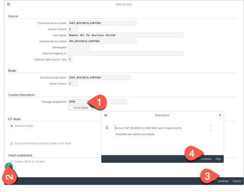

**Result:** The API_BUSINESS_PARTNER is now activated and you can leave the transaction.

### Create User and assign Roles and Authorization Objects

#### **A: Create User**
In this section we will create a new user in the SAP S/4HANA system and assign the SAP_BR_BUPA_MASTER_SPECIALIST role to him.  

1. Call Transaction SU01
   1. Enter a user ID
   2. Click on Create

    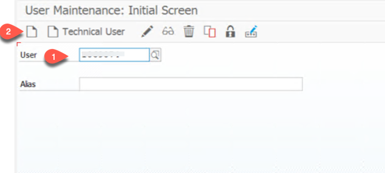
 
2.  Do the following:
    1.  Select the "Address" tabulator
    2.  Set the "Last name"
    3.  Set a valid e-mail address. 
        
        ***Important:** this email is the principal for the SSO communication that we will configure in a later section*
    4. Select the "Logon Data" tabulator.

    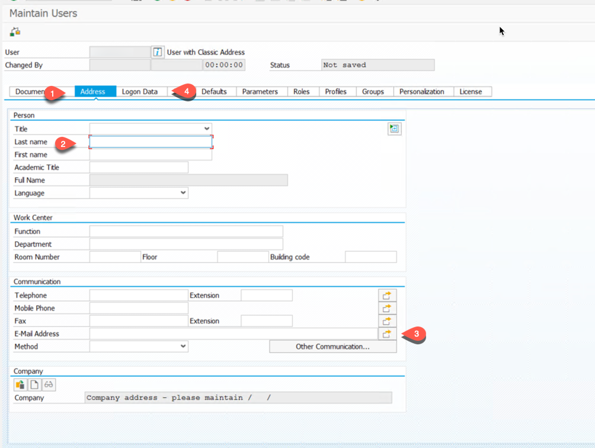

3. Logon Data Tabulator:
    1. Select User Type = System
    2. Set a Password
    3. Repeat the Password
    4. Select the Roles Tab     
    
    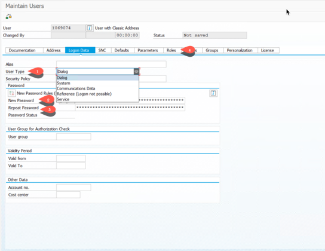
4. Roles Tabulator:
   1. Select the first empty row in the the Roles list and click on add Roles
   
   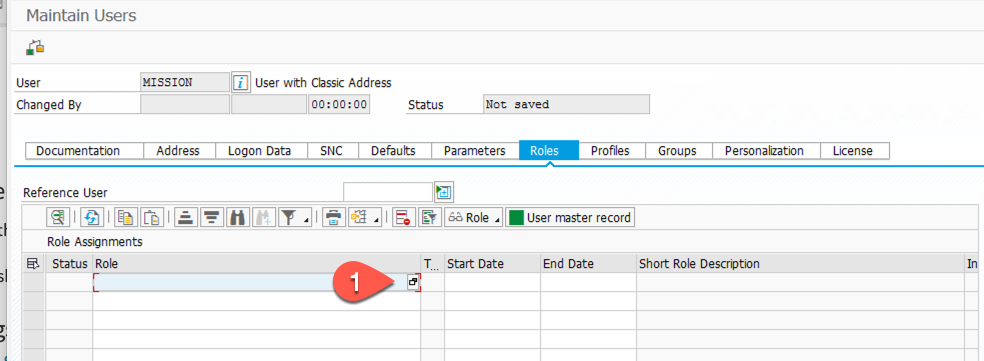

5. Find Role
   1. In the Single Role field enter "SAP_BR_BUPA*" 
   2. Click on Enter
   
    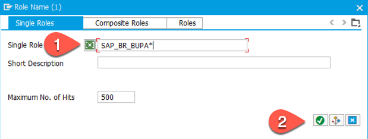

6. Role Selection:
   1. Select the SAP_BR_BUPA_MASTER Specialist role
   2. Click on enter/copy.
   
       ***Hint:** This role is necessary to get access to the Business Partner data and the Business Partner Fiori application*
   
   

7. Maintain Users:
   1. Click on Save
   
   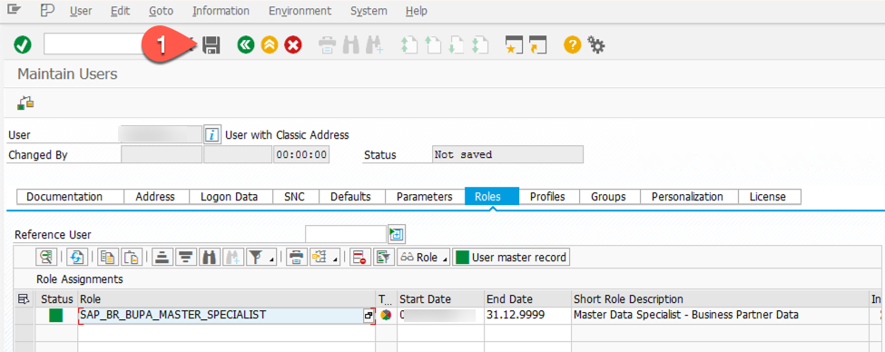 

####  **B: Create Authorization Object for oData service**
In this section we generate a custom authorization object which is necessary to give the user access to the Gateway and to the Business Partner oData service.

1. Call Transaction PFCG
   1. Enter a new Role name 
   2. Click on Single Role

    

2. Set Authorizations
   1. Click on Save
   2. Select the Authorization tabulator
   3. Click the icon at "Change Authorization Data"
   
   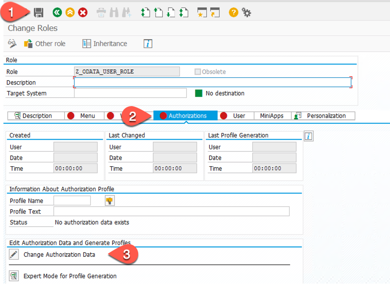

3.  Choose Template
    1.  Select the Template for Gateway users (/IWFND/RT_GW_USER)
    2.  Click "Apply Template" and click on "Save"

    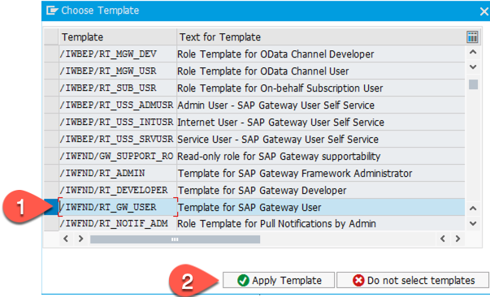

4. Click on Status and then “Execute” to assign the Authorization

    

5. Click on Generate (Shift+F5) 
   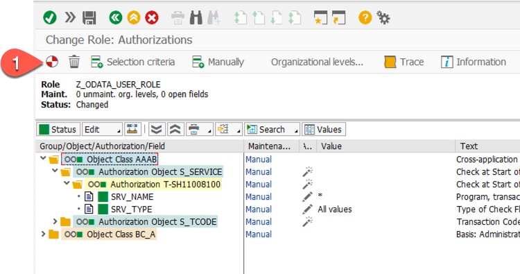

6. Menu
    1. Select the Menu tabulator
    2. Click on Transaction and select "Authorization Default"
   
   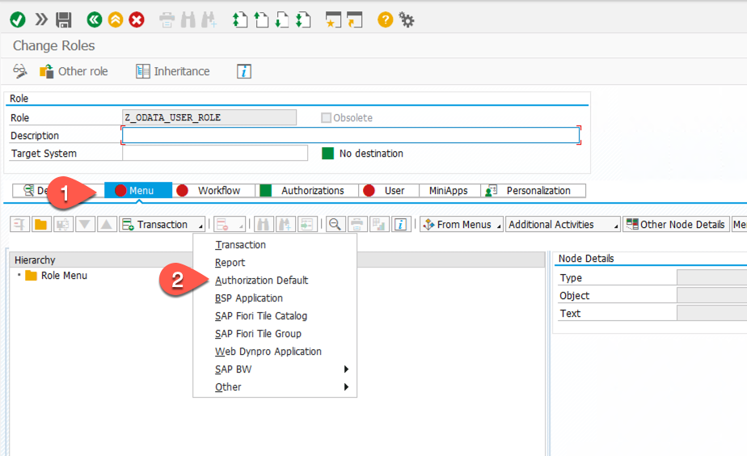

7. Set Service
   1. Select "TADIR Service" as Authorization Default
   2. Select “IWSG SAP Gateway: Service Groups Metadata” as Object Type
   3. Open the Object list

   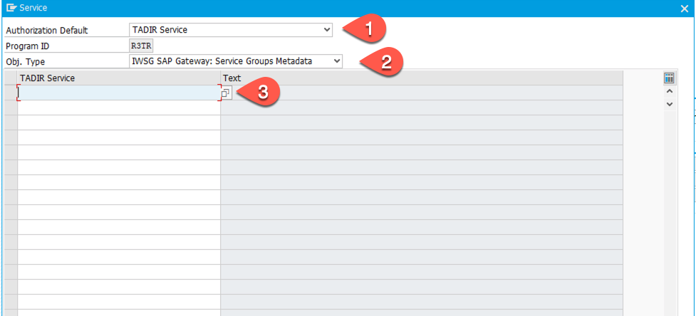

8. Object List 
   1. Select the object ZAPI_BUSINESS_PARTNER_0001
   2. Click on confirm button

   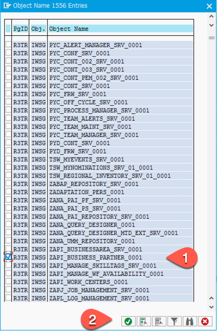

9.  Copy the TADIR service to the Menu and press save.
      
      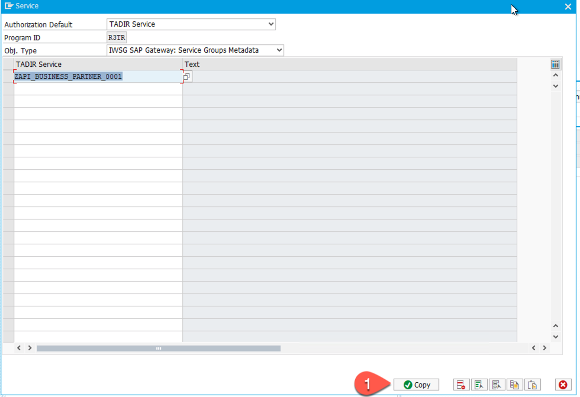

10. User Setup
    1.  Save the Authorization Object
    2.  Select the User tabulator
    3.  Enter or select the user ID you have created in section A
    4.  Click on "User Comparision"
   
    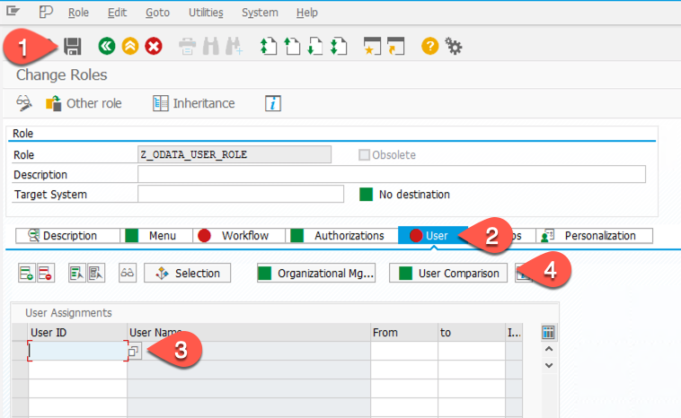
  
11. Complete Comparion
    
    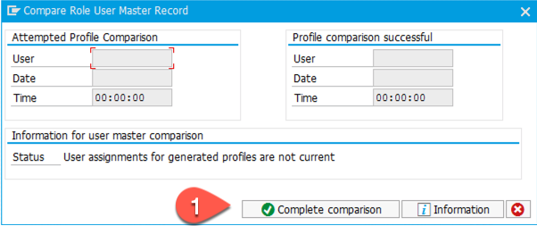

12. Click on Save and you have finished the setup of the user profile     

***Hint:** If the Authentication tabulator turns to red, select this tabulator and select again "Change Authorization Data" - click again on Generate (Shift+F5) - Click on Save*

### Test the API_BUSINESS_PARTNER_SRV

To see if the setup was done correctly call the Business Partner API with the new user. 

* Call Transaction /N/IWFND/MAINT_SERVICE
    1. Double-click on ZAPI_BUSINESS_PARTNER
    2. Click on Call Browser
   
    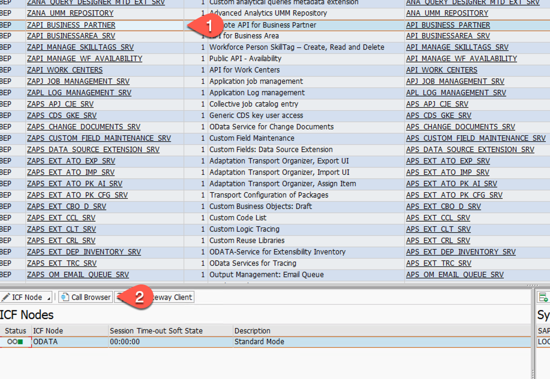
    
    Hint: If you use a CAL system, kindly check and use the relevant IP address instead of the default system host name as the host name has to be resolvable by the browser.

* Enter the credentials of the user we have created. You should then see the structure of the BusinessPartner oData service.

    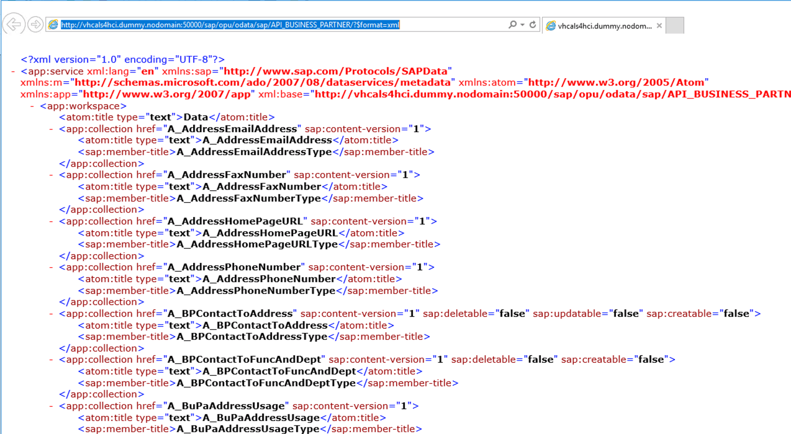

*  Change the end ot the URL to ..../sap/API_BUSINESS_PARTNER/A_BusinessPartner/?$format=xml. You should now see a list of Business Partners.

This completes this mission section.

## Summary

You have activated an API in the S/4 on-premise system and created a user with the necessary roles for CRUD operations of Business Partner data and to access the API_BUSINESS_PARTNER_SRV oData service.

***Hint:** the simplest way for adding additional users with the same roles is just to copy this user profile in the SU01 transaction*
